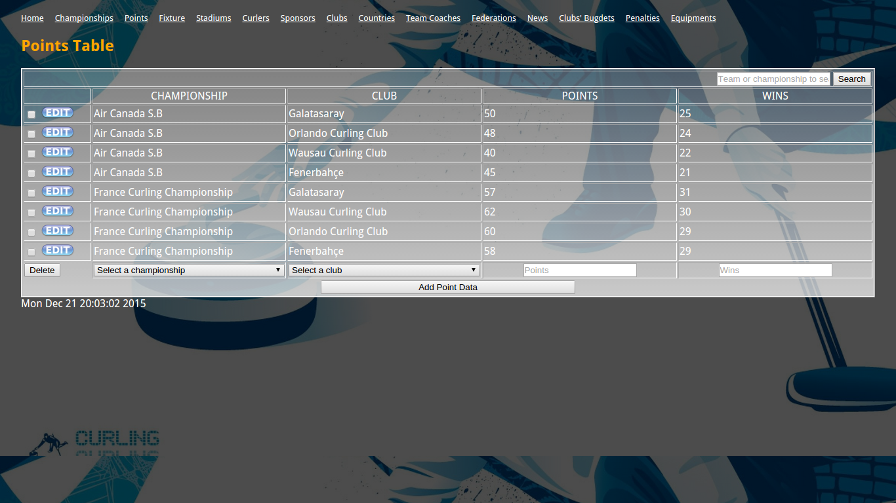
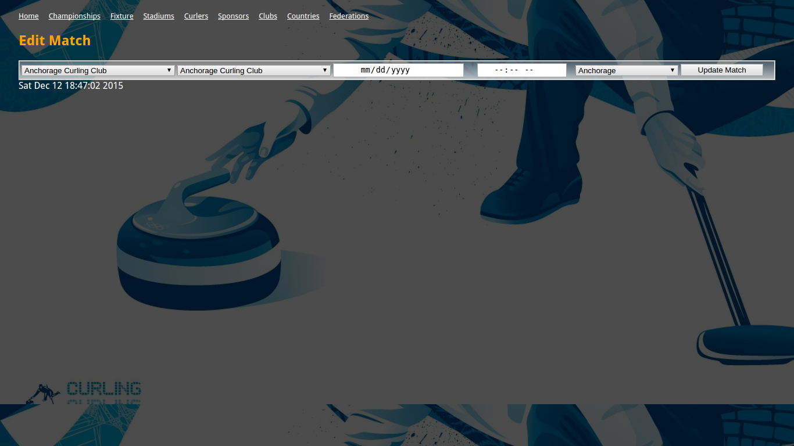
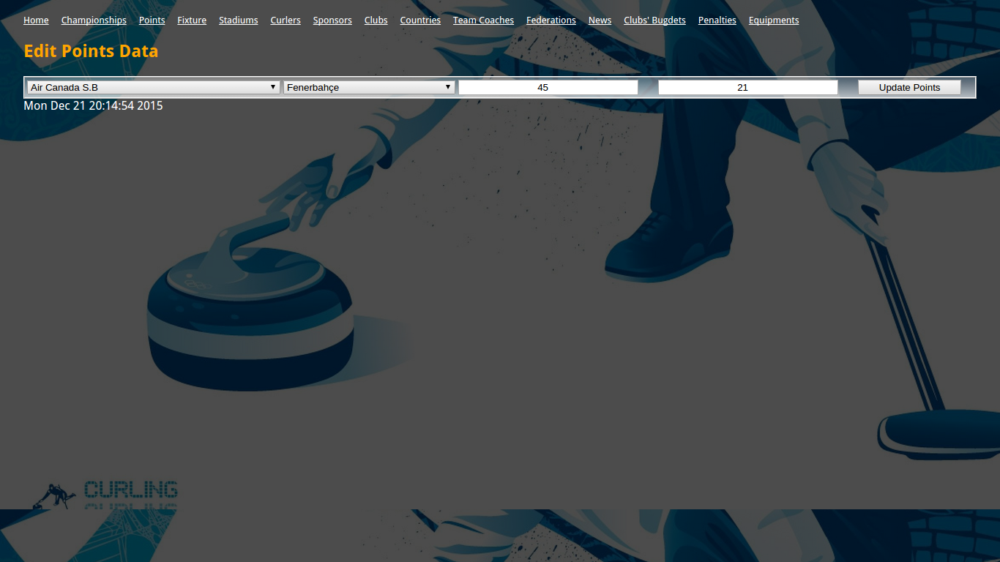

Parts Implemented by Sercan Bayındır
====================================

   Here we see a screenshot of the stadium table

Users can easily
   1) Add new stadiums by add section below

   2) Edit existing stadium data by clicking on edit button

   3) Delete existing stadium data with selecting multiple checkboxes and clicking on delete button

   4) Search for existing stadiums by name or by location writing initial letter is enough

   5) Look to matches that is scheduled in a stadium by clicking on the name of the stadium

   Here wee see a screenshot of the fixture table

Users can easily
   1) Add new matches by add section below

   2) Edit existing match data by clicking on edit button

   3) Delete existing match data with selecting multiple checkboxes and clicking on delete button

   4) Search for existing match by name writing initial letter is enough

   Here wee see a screenshot of the points table

Users can easily
   1) Add new points data for teams in a certain championship by add section below

   2) Edit existing points data by clicking on edit button

   3) Delete existing points data with selecting multiple checkboxes and clicking on delete button

   4) Search for existing points data by club name or championship name writing initial letter is enough

.. figure:: static/stadium_edit.png
   :alt: edit section of stadium table screenshot

   Here we see edit section of the stadium table

Here users edit the properties of the stadium
as they liked and save the changed data by clicking on the
Update Stadium button.

   Here we see edit section of the fixture table

Here users edit the properties of the match
as they liked and save the changed data by clicking on the
Update Match button.

   Here we see edit section of the points table

Here users edit the properties of the points data
as they liked and save the changed data by clicking on the
Update Points button.