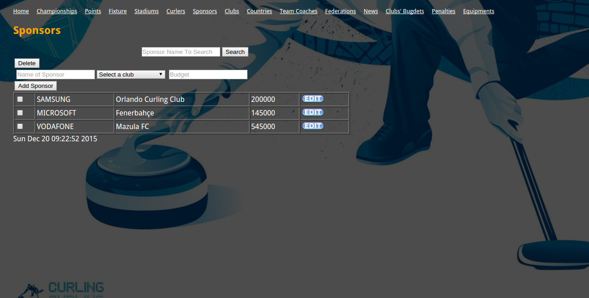
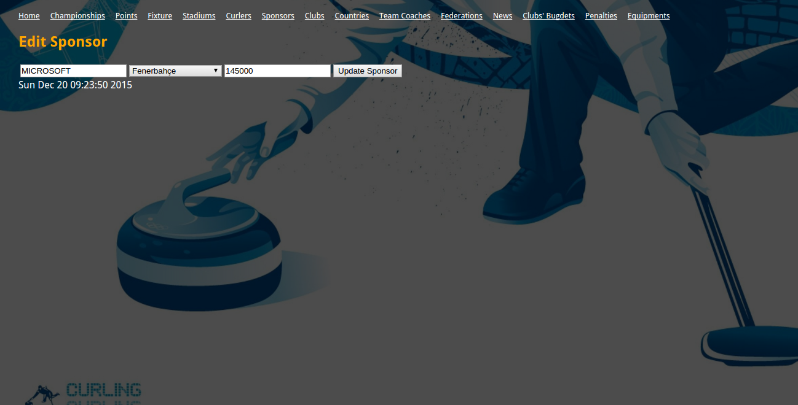

Parts Implemented by M. Aziz ULAK
=================================

   The main page of Sponsors Table

In this Interface Following Features Are Possible To Perform
   *1) Add New Sponsor*
      The form inputs , Sponsor Name , Supported Team and Budget fills then press "Add Sponsor" button to add operation.

   *2) Edit Sponsor*
      If you want to edit a sponsor information just press the "Edit" button.

   *3) Delete Sponsor*
      To delete a sponsor , select the checkbox of that sponsor's row and press "Delete" button.

   *4) Search Sponsor*
      If you want to search a sponsor , just write the "Sponsor Name" to search bar and click "Search" button. Note that, the full name is mandatory to search successfully.

   The edit page of Sponsors Table
