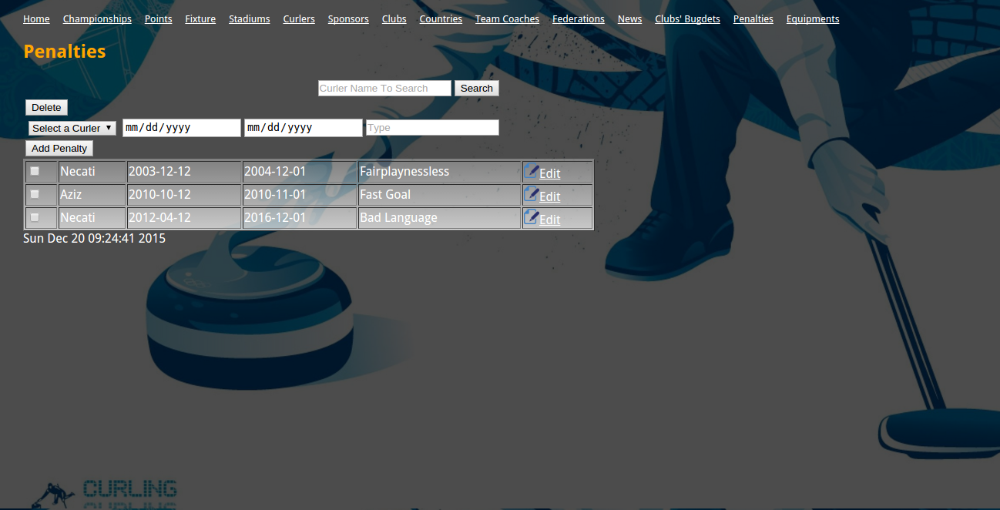
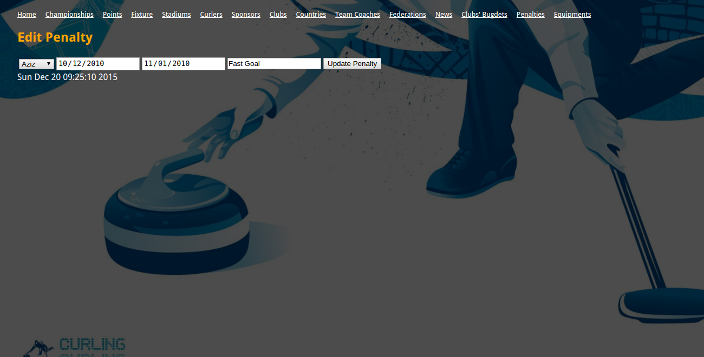
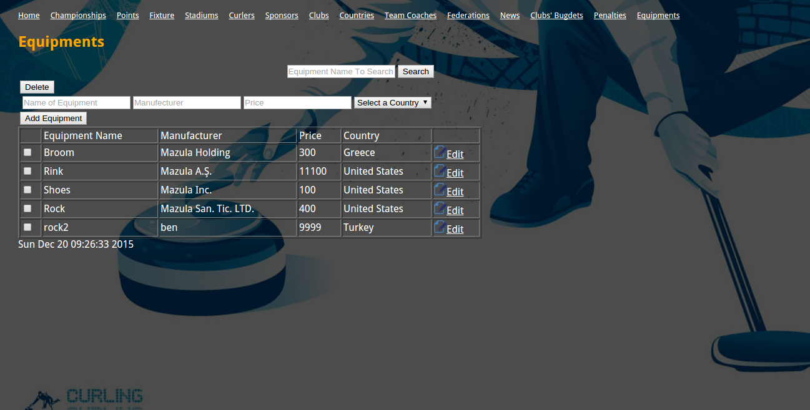
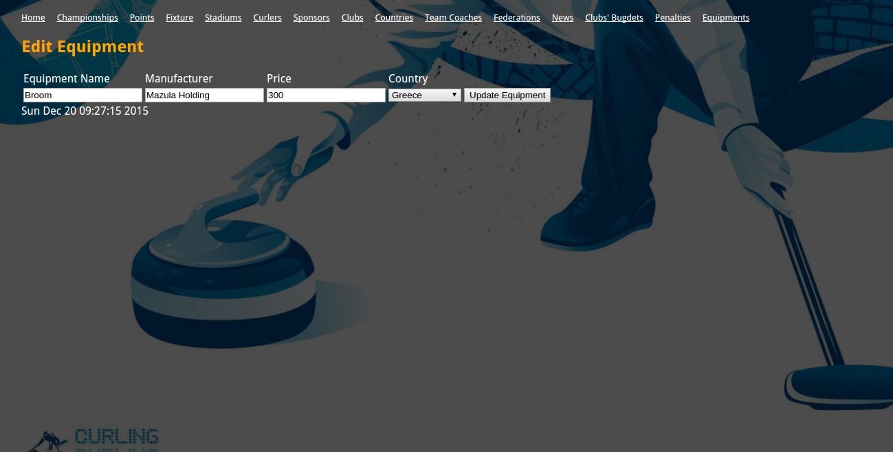

Parts Implemented by M. Aziz ULAK
=================================

SPONSORS
========

.. figure:: static/sponsorsmain.png
   :scale: 50%
   :alt: sponsors table screenshot

   The main page of Sponsors Table

In this Interface Following Features Are Possible To Perform
   *1) Add New Sponsor*
      The form inputs , Sponsor Name , Supported Team and Budget fills then press "Add Sponsor" button to add operation.

   *2) Edit Sponsor*
      If you want to edit a sponsor information just press the "Edit" button.

   *3) Delete Sponsor*
      To delete a sponsor , select the checkbox of that sponsor's row and press "Delete" button.

   *4) Search Sponsor*
      If you want to search a sponsor , just write the "Sponsor Name" to search bar and click "Search" button. Note that, the full name is mandatory to search successfully.

.. figure:: static/sponsorsupdate.png
   :scale: 50%
   :alt: sponsors edit screenshot

   The edit page of Sponsors Table

In the image above , the user can easily update the values of attributes that selected sponsor. Then Press "Update Sponsor" button to save changes.

PENALTY
=======

   The main page of Penalty Table

In this Interface Following Features Are Possible To Perform
   *1) Add New Penlty*
      The form inputs , Curler Name (from selective tool) , Start date of penalty , End date of penalty and The type of penalty  fills then press "Add Penalty" button to add operation.

   *2) Edit Penalty*
      If you want to edit a penalty information just press the "Edit" button.

   *3) Delete Penalty*
      To delete a penalty , select the checkbox of that penalty's row and press "Delete" button.

   *4) Search Penalty*
      If you want to search a penalty of the curler , just write the "Curler's Name" to search bar and click "Search" button. Note that, the full name is mandatory to search successfully.

   The edit page of Penalty Table

In the image above , the user can easily update the values of attributes that selected Penalty. Then Press "Update Penalty" button to save changes.

EQUIPMENTS
==========

   The main page of Equipments Table

In this Interface Following Features Are Possible To Perform
   *1) Add New Equipment*
      The form inputs , Name Of The Equipment , Manufacturer,Price and Country of Manufacturer(Selective tool) fills then press "Add Equipment" button to add operation.

   *2) Edit Equipment*
      If you want to edit an equipment information just press the "Edit" button.

   *3) Delete Equipment*
      To delete a equipment , select the checkbox of that equipment's row and press "Delete" button.

   *4) Search Equipment*
      If you want to search a equipment , just write the "Equipment's Name" to search bar and click "Search" button. Note that, the full name is mandatory to search successfully.

   The edit page of Equipments Table

In the image above , the user can easily update the values of attributes that selected Penalty. Then Press "Update Penalty" button to save changes.
