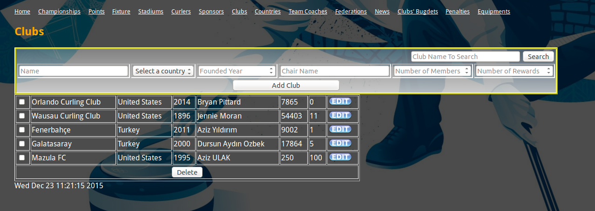
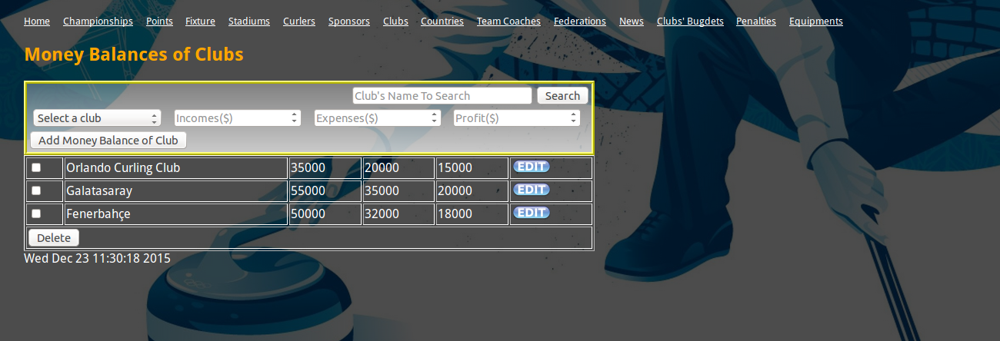
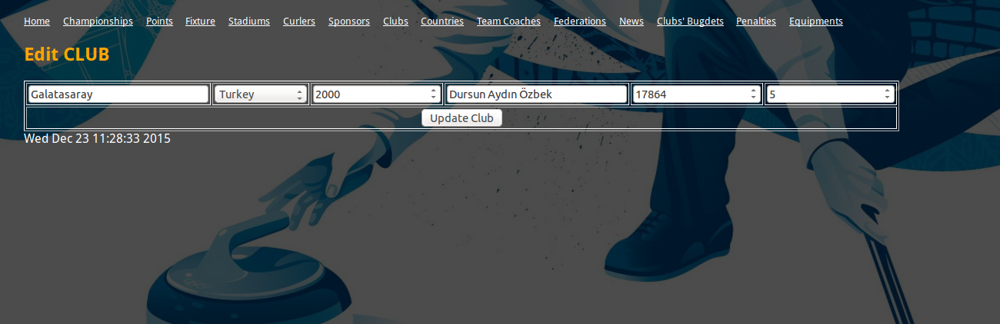
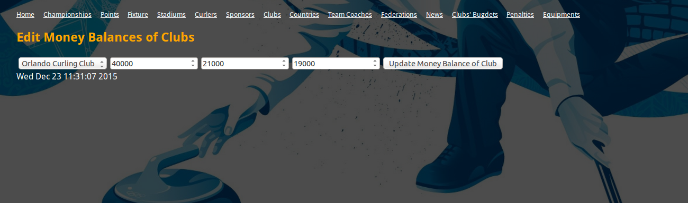

Parts Implemented by Sema KARAKAŞ
=================================

   Here we see a screenshot of the clubs table

Users can easily
   1) Add new club by add section above

   2) Edit existing club data by clicking on edit button

   3) Delete existing club data with selecting multiple checkboxes and clicking on delete button

   4) Search for existing clubs by name

   Here wee see a screenshot of the money balance table

Users can easily
   1) Add new money balance of a club by add section above

   2) Edit existing money balance of a club by clicking on edit button

   3) Delete existing money balance of clubs with selecting multiple checkboxes and clicking on delete button

   4) Search for existing money balance of a club by name writing name of club

   Here we see edit section of the clubs table

Here users edit the properties of the clubs
as they liked and save the changed data by clicking on the
Update Club button.

   Here we see edit section of the money balance table

Here users edit the properties of the money balance of club
as they liked and save the changed data by clicking on the
Update Money Balance of Club button.
