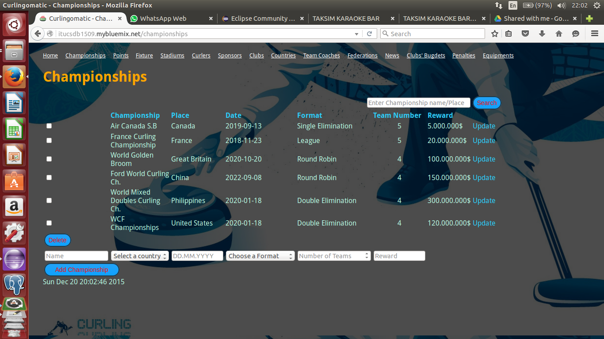
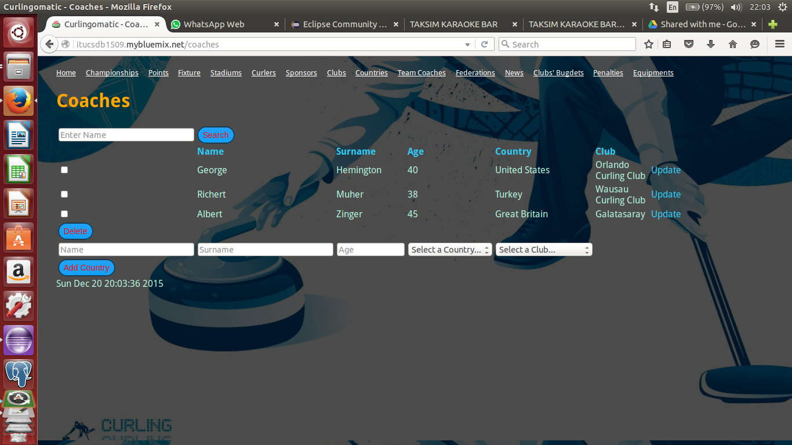
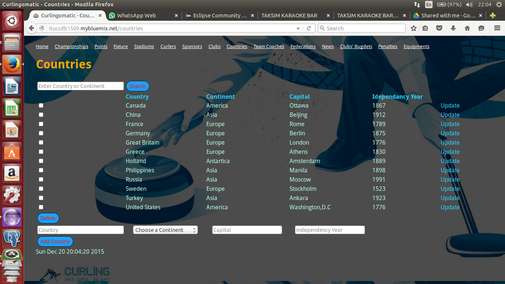
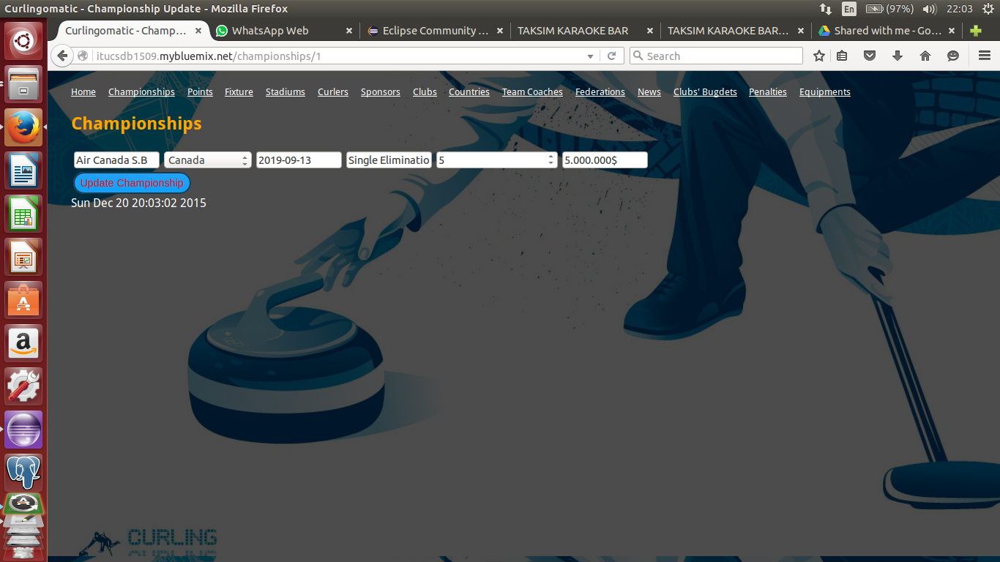
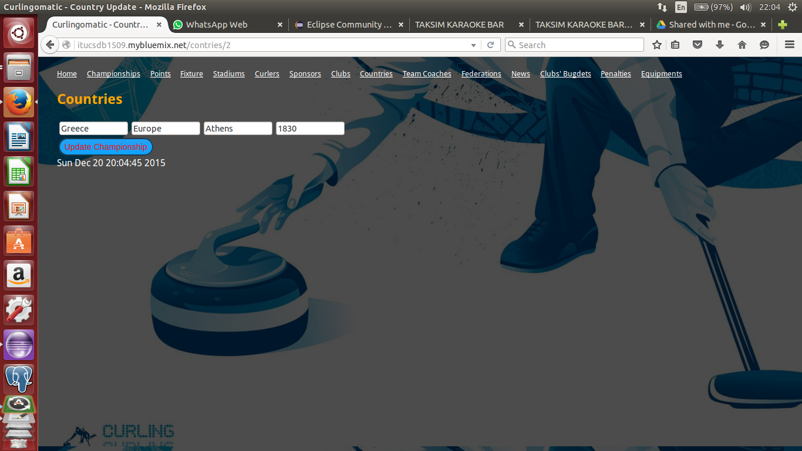
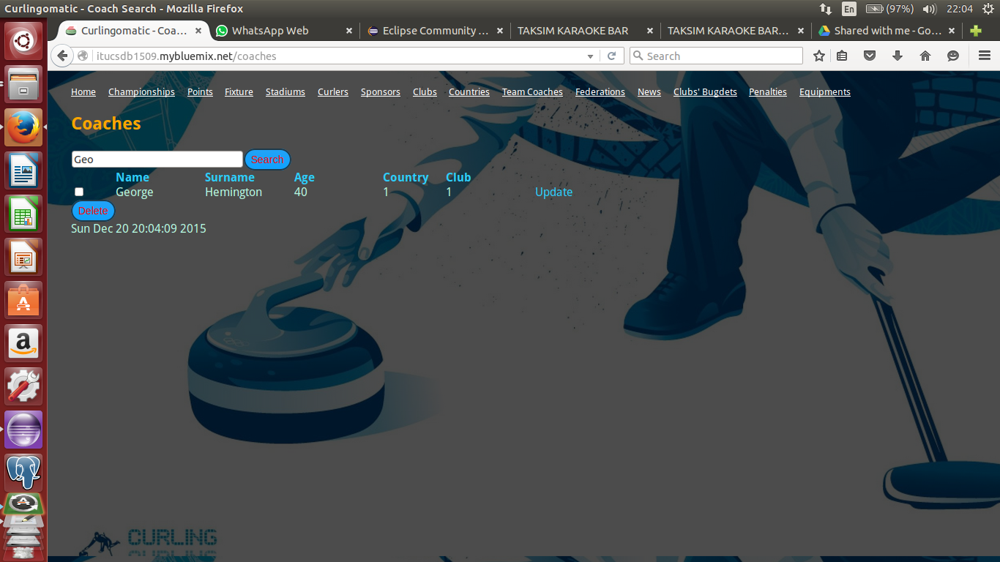
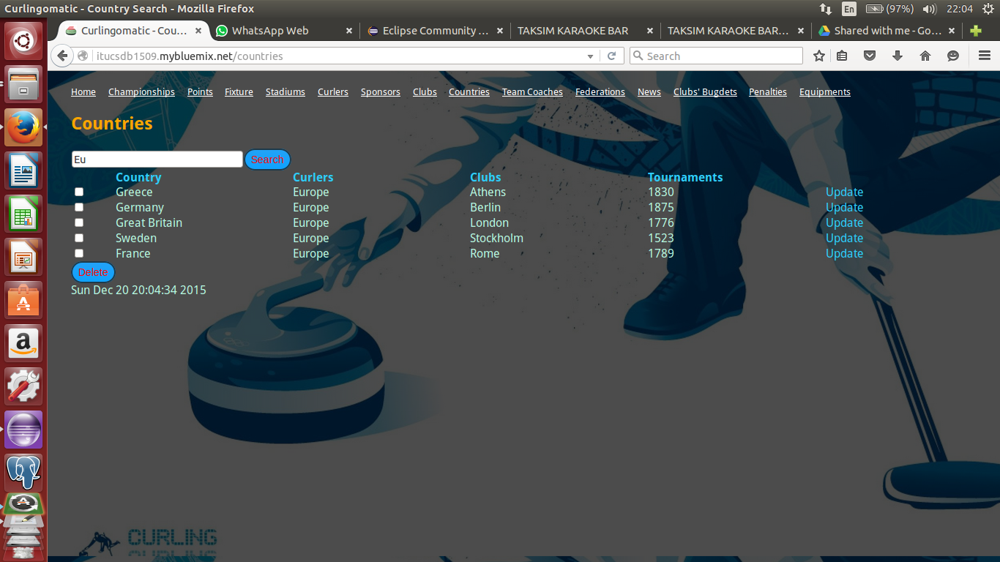
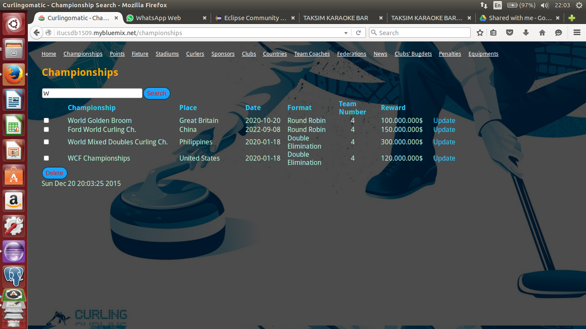

Parts Implemented by Chousein Giousouf(Huseyin Yusuf)
======================================================

   Here we see a screenshot of the Championship table

Users can easily
   1) Add new Championship by add section below

   2) Edit existing Championship data by clicking on update button

   3) Delete existing Championship data with selecting multiple checkboxes and clicking on delete button

   4) Search for existing Championship by name or by place writing anylater that exist at name or place

   Here wee see a screenshot of the Coach table

Users can easily
   1) Add new Coach by add section below

   2) Edit existing Coach data by clicking on update button

   3) Delete existing Coach data with selecting multiple checkboxes and clicking on delete button

   4) Search for existing Coach by name writing any letter in the name

   Here wee see a screenshot of the Countries table

Users can easily
   1) Add new Countries by add section below

   2) Edit existing Countries data by clicking on update button

   3) Delete existing Countries data with selecting multiple checkboxes and clicking on delete button

   4) Search for existing Countries by writing any later of the country name or country continent

   Here we see edit section of the Championship table

Here users edit the properties of the Championship
as they liked and save the changed data by clicking on the
Update  button.

   Here we see edit section of the Countries table

Here users edit the properties of the Countries
as they liked and save the changed data by clicking on the
Update button.

.. figure:: static/Coaches_update.png
   :scale: 50%
   :alt: update section of Coaches table screenshot

   Here we see edit section of the Coaches table

Here users edit the properties of the Coaches
as they liked and save the changed data by clicking on the
Update button.

   Here we see search section of the Coaches table

Here users search the Coaches according to name
and observe the results according their search by clicking on the
Search button.

   Here we see search section of the Countries table

Here users search the Countries according to name or continent
and observe the results according their search by clicking on the
Search button.

   Here we see search section of the Championships table

Here users search the Countries according to championship name or place
and observe the results according their search by clicking on the
Search button.
