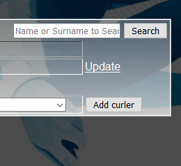

Parts Implemented by Ilkan Engin (150120137)
======================================================

   Here we see a screenshot of the Curlers Page

Users can easily
   1) Add new Curler by add section below

   2) Edit existing Curler data by clicking on update button

   3) Delete existing Curler data with selecting multiple checkboxes and clicking on delete button

   4) Search for existing Curler by name or surname writing anylater that exist at name or surname

.. figure:: static/Federations_mainpage.png
   :scale: 50%
   :alt: Federations page screenshot

   Here wee see a screenshot of the Federations Page

Users can easily
   1) Add new Federation by add section below

   2) Edit existing Federation data by clicking on update button

   3) Delete existing Federation data with selecting multiple checkboxes and clicking on delete button

   4) Search for existing Federation by name of the federation or president writing any letter in the name of federation or president

   Here wee see a screenshot of the News Page

Users can easily
   1) Add new News by clicking add button below

   2) Edit existing News data by clicking on update button

   4) Search for existing News by writing any letter of the news header or description

   Here we see edit section of the Curlers Page

Here users edit the properties of the Curler
as they want them to be and save the changed data by clicking on the
Update button.

   Here we see edit section of the Countries table

Here users edit the properties of the Federations
as they want them to be and save the changed data by clicking on the
Update button.

   Here we see edit section of the News table

Here users edit the properties of the news
as they want them to be and save the changed data by clicking on the
Update button.

   Here we see search section of the Curlers table

Here users search the Curlers according to name or surname
and observe the results according their search by clicking on the
Search button.

   Here we see search section of the Federations table

Here users search the Federations according to name of the federation or name of the President
and observe the results according their search by clicking on the
Search button.

   Here we see search section of the News table

Here users search the Countries according to news header or description
and observe the results according their search by clicking on the
Search button.
